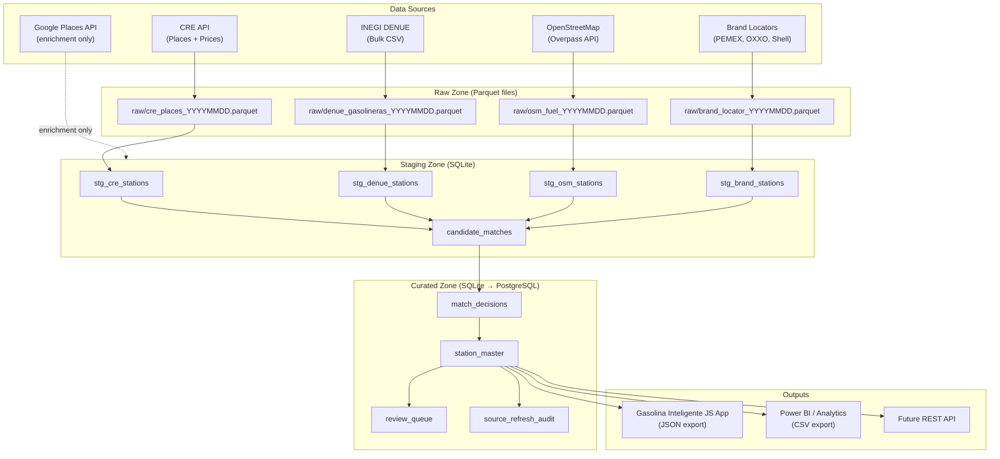

# Gasolina Inteligente — Data Pipeline Architecture
## Mexico Gas Station Master Dataset System

---

### 1. EXECUTIVE SUMMARY

Production-grade Python pipeline that seeds from CRE official data, enriches from OSM/DENUE/Google Places, resolves duplicates via entity resolution, links PL permit numbers, tracks confidence and freshness, and feeds the Gasolina Inteligente JS app.

**Chosen MVP:** SQLite + DuckDB + plain Python + cron
**Chosen Production:** PostgreSQL+PostGIS + Prefect + S3

The pipeline is responsible for building and maintaining a **Mexico Gas Station Master Dataset** — a deduplicated, geo-validated, confidence-scored catalog of all ~12,000 active gas stations in Mexico, enriched with CRE permit numbers (PL numbers), canonical brand names, and normalized addresses. This master dataset is the authoritative record powering all price displays, alerts, and analytics in the Gasolina Inteligente app.

---

### 2. SYSTEM GOALS

1. **Seed a complete Mexico gas station master** from CRE official data as the authoritative source of truth for permit (PL) numbers and legal entity names.
2. **Enrich each station** with geo-coordinates, commercial brand names, and address details from OSM, DENUE, and brand locator pages.
3. **Deduplicate across sources** using multi-dimensional entity resolution (name, geo, brand, address) so each physical station has exactly one master record.
4. **Link PL permit numbers** to master records, enabling compliance-level station identification and price attribution.
5. **Track data confidence and freshness** with composite scoring, so the app can surface data quality to end users (e.g., "data last confirmed 3 days ago, confidence 94%").
6. **Enable incremental daily updates** via delta detection — only re-process records that have actually changed, minimizing compute cost.
7. **Export clean, app-ready JSON** in the exact format consumed by the Gasolina Inteligente JS frontend, eliminating any data transformation in the app layer.

---

### 3. FUNCTIONAL REQUIREMENTS

| ID | Requirement |
|----|-------------|
| FR-01 | Ingest CRE Places API data (station identity + PL numbers) on weekly cadence |
| FR-02 | Ingest CRE Prices API data (fuel prices per station) on daily cadence |
| FR-03 | Ingest INEGI DENUE bulk CSV for SCIAN code 46411 (gas stations) on monthly cadence |
| FR-04 | Ingest OpenStreetMap amenity=fuel data for Mexico bounding box on weekly cadence |
| FR-05 | Scrape PEMEX, OXXO GAS, and Shell Mexico brand locator pages on weekly cadence |
| FR-06 | Normalize all station names: strip accents, expand abbreviations, remove legal suffixes, token sort |
| FR-07 | Normalize all addresses using Mexican address conventions (AV, BLVD, S/N, KM markers) |
| FR-08 | Normalize all brand names to canonical set (PETRO7 → PEMEX, OXXOGAS → OXXO GAS, etc.) |
| FR-09 | Validate all coordinates against Mexico geographic bounding box |
| FR-10 | Generate candidate pairs for entity resolution using geographic blocking (geohash-6) and administrative blocking (state + municipality) |
| FR-11 | Score candidate pairs on 5 dimensions: name, geo, brand, address, source reliability |
| FR-12 | Auto-match candidates with composite score ≥ 0.85; queue for review if 0.65–0.84; reject if < 0.65 |
| FR-13 | Generate human-readable match explanation JSON for every candidate pair |
| FR-14 | Maintain a review queue (SQLite table) for candidates requiring human judgment |
| FR-15 | Build and maintain `station_master` table with canonical fields, confidence score, and source lineage |
| FR-16 | Run 10 defined QA checks after every refresh, writing results to QA report |
| FR-17 | Detect delta changes between refresh batches using content hashing; skip unchanged records |
| FR-18 | Export master dataset to JSON in the Gasolina Inteligente app format after every successful refresh |
| FR-19 | Write source_refresh_audit record for every pipeline run (records fetched, new, updated, failed, duration) |
| FR-20 | Support --mock flag on all scripts for offline testing with synthetic data |

---

### 4. NON-FUNCTIONAL REQUIREMENTS

**Performance:**
- Daily CRE price refresh must complete in < 5 minutes end-to-end
- Full weekly refresh (all sources) must complete in < 2 hours
- Entity resolution blocking must reduce candidate pairs from 144M (12K × 12K) to < 500K
- Single QA report generation must complete in < 30 seconds

**Reliability:**
- HTTP source fetches must retry 3 times with exponential backoff before failing
- Pipeline must be idempotent: re-running with the same batch_id must produce the same result
- Failed records must not block successful records; write to dead-letter parquet file
- Source_refresh_audit must be written even if the pipeline step fails (for debugging)

**Cost:**
- MVP must run at $0/month (SQLite on local machine or free-tier VPS)
- Google Places API usage must be limited to review queue items only (never bulk)
- Production target: < $100/month total infrastructure cost

**Maintainability:**
- Every normalization rule must be in a named constant (no magic strings)
- Every match threshold must be in config.py (no hardcoded numbers in logic)
- Every source must be an independent, swappable client module
- All pipeline steps must be unit-testable with mocked HTTP responses

---

### 5. DATA SOURCE STRATEGY

| Source | Type | Auth Required | PL Number | Station Name | Geo | Refresh Cadence | Cost |
|--------|------|---------------|-----------|--------------|-----|-----------------|------|
| CRE Prices API (publicacionexterna.azurewebsites.net/publicaciones/prices) | REST API | No | Station IDs map to PL | Legal entity name | No | Daily | Free |
| CRE Places API (publicacionexterna.azurewebsites.net/publicaciones/places) | REST API | No | Station IDs map to PL | Legal entity name | Yes | Weekly | Free |
| INEGI DENUE (datosabiertos.inegi.org.mx) | Bulk CSV download | No | Cross-reference | Legal + commercial | Yes | Monthly | Free |
| OpenStreetMap Overpass API (overpass-api.de) | REST API | No | Sometimes tagged | Commercial name | Yes | Weekly | Free |
| Waze Map Editor data | Public export | No | No | Commercial name | Yes | Monthly | Free |
| Brand locator pages (PEMEX, OXXO GAS, Shell Mexico, BP Mexico) | Web scraping | No (rate-limited) | Sometimes | Official commercial | Yes | Weekly | Free |
| Google Places API | REST API | API Key required | No | Best current name | Yes | On-demand only | $0.017/request |
| HERE Places API | REST API | API Key required | No | Current name | Yes | On-demand only | Freemium |
| OpenCage Geocoding | REST API | No (low volume) | No | No | Geocoding | On-demand | Free tier 2500/day |

---

### 6. SOURCE PRIORITY HIERARCHY

**For PL-number linkage (best to worst):**
1. **CRE Places/Prices API** — station IDs ARE the CRE permit identifiers; no cross-reference needed
2. **INEGI DENUE** — has official business registry with permit cross-reference for SCIAN 46411
3. **Brand locator pages** — PEMEX locator sometimes lists permit numbers in station detail pages
4. **OSM** — community-tagged; sometimes has PL numbers in `ref:MX:CRE` tag
5. **Google Places** — no permit data whatsoever

**For current station naming (best to worst):**
1. **Brand locator pages** — official commercial names as used in branding and signage
2. **Google Places API** — most current consumer-facing names, updated frequently
3. **OSM** — community maintained, often accurate for commercial names
4. **INEGI DENUE** — legal entity name (razón social), may differ significantly from commercial name
5. **CRE Places API** — legal entity name only; rarely matches what appears on the station sign

---

### 7. HIGH-LEVEL SYSTEM ARCHITECTURE



---

### 8. PROJECT FOLDER STRUCTURE

```
gasolina-inteligente/
└── pipeline/
    ├── README.md
    ├── requirements.txt
    ├── config.py                    ← all constants, thresholds, paths
    ├── models/
    │   ├── __init__.py
    │   ├── station.py               ← Pydantic models for all stages
    │   └── match.py                 ← match/decision models
    ├── sources/
    │   ├── __init__.py
    │   ├── cre_client.py            ← CRE Places + Prices API (no auth)
    │   ├── osm_client.py            ← Overpass API (no auth)
    │   ├── denue_client.py          ← INEGI DENUE bulk CSV
    │   ├── brand_scraper.py         ← PEMEX/OXXO/Shell locator pages
    │   └── google_client.py         ← Google Places (needs key)
    ├── normalize/
    │   ├── __init__.py
    │   ├── text.py                  ← accent/punct/abbrev normalization
    │   ├── brands.py                ← brand alias → canonical name
    │   ├── address.py               ← Mexico address normalization
    │   └── geo.py                   ← coordinate validation + snapping
    ├── match/
    │   ├── __init__.py
    │   ├── blocking.py              ← candidate generation via blocking keys
    │   ├── scorer.py                ← weighted multi-field match scoring
    │   ├── resolver.py              ← auto-match / review / reject decision
    │   └── explainer.py            ← human-readable match explanation JSON
    ├── storage/
    │   ├── __init__.py
    │   ├── db.py                    ← SQLAlchemy engine + session factory
    │   ├── schema.py                ← SQLAlchemy table definitions
    │   ├── raw_zone.py              ← parquet read/write helpers
    │   ├── staging_zone.py          ← staging table operations
    │   └── curated_zone.py         ← master table upsert logic
    ├── quality/
    │   ├── __init__.py
    │   ├── checks.py                ← 10 QA rules
    │   └── reporter.py             ← QA report generator
    ├── orchestration/
    │   ├── __init__.py
    │   ├── pipeline.py             ← full pipeline DAG
    │   └── schedule.py             ← cron schedule definitions
    ├── scripts/
    │   ├── seed.py                 ← one-time initial seed
    │   ├── refresh.py              ← daily/weekly delta refresh
    │   ├── review_queue.py         ← review queue CLI tool
    │   └── export_for_app.py       ← export JSON for JS app
    └── data/
        ├── raw/                    ← parquet snapshots by date
        ├── staging/                ← SQLite databases
        └── curated/                ← final outputs
```

---

### 9. MODULE-BY-MODULE PYTHON DESIGN

**`config.py`**
- All API base URLs as string constants
- All file path constants derived from `Path(__file__).parent`
- All match thresholds: `AUTO_MATCH_THRESHOLD`, `REVIEW_MIN_THRESHOLD`
- All score weights: `NAME_WEIGHT`, `GEO_WEIGHT`, `BRAND_WEIGHT`, `ADDRESS_WEIGHT`, `SOURCE_REL_WEIGHT`
- `SOURCE_RELIABILITY` dict mapping source name → float
- `MEXICO_BOUNDS` namedtuple with lat_min, lat_max, lng_min, lng_max
- `REFRESH_FREQUENCIES` dict mapping source → timedelta

**`models/station.py`**
- `RawCREStation`: place_id, cre_id, nombre, razon_social, marca, domicilio, municipio, estado, cp, latitud, longitud, fetched_at
- `RawOSMStation`: osm_id, osm_type, name, brand, addr_street, addr_city, addr_state, lat, lng, tags
- `RawDENUEStation`: denue_id, nom_estab, raz_social, nombre_act, municipio, entidad, lat, lng, cp, codigo_act
- `StagingStation`: unified normalized representation across all sources
- `MasterStation`: canonical curated record with confidence_score, source_ids, pl_number
- Validators: coordinate bounds checking, brand normalization in `@field_validator`

**`models/match.py`**
- `CandidatePair`: source_a, source_b (StagingStation), blocking_reason
- `MatchScores`: name_score, geo_score, brand_score, address_score, source_reliability_score, composite_score, distance_meters
- `MatchDecision`: decision enum (auto_match/review_queue/rejected), decided_by, notes
- `MatchExplanation`: per-dimension human-readable strings + composite JSON
- `ReviewQueueItem`: candidate_id, composite_score, priority, all source fields flattened for CSV export

**`sources/cre_client.py`**
- `CREClient` class with `fetch_places()` and `fetch_prices()` methods
- Handles both JSON and XML responses from the CRE endpoint
- Uses `httpx.Client` with `tenacity.retry` decorator
- `save_raw_parquet()` writes dated snapshots

**`sources/osm_client.py`**
- `OSMClient` class with `fetch_fuel_stations()` method
- Builds Overpass QL query for `amenity=fuel` within Mexico bbox
- Handles both `node` and `way` element types
- Rate-limits to 1 request per 2 seconds

**`normalize/text.py`**
- Pure functions: `strip_accents()`, `normalize_name()`, `token_sort()`, `normalize_for_comparison()`
- All constants defined at module level: `LEGAL_SUFFIXES`, `ABBREVIATIONS`, `STOP_WORDS`

**`normalize/brands.py`**
- `BRAND_ALIASES` dict (40+ entries)
- `normalize_brand()` with exact-match fallback to fuzzy (rapidfuzz ratio > 80)
- `get_brand_confidence()` returns confidence based on match method used

**`normalize/address.py`**
- `normalize_address()`: expands street type abbreviations, handles S/N, KM markers
- `normalize_state()`: maps all state abbreviations to official INEGI names
- `normalize_municipality()`: lightweight normalization (accent strip + title case)

**`normalize/geo.py`**
- `validate_coordinates()`: checks Mexico bounds
- `score_geo_proximity()`: distance-based scoring per the spec formula
- `compute_geohash()`: wraps geohash2 library
- `haversine_meters()`: pure Python haversine formula

**`match/blocking.py`**
- `generate_candidates()`: accepts list of StagingStation, returns list of CandidatePair
- Two-pass: geographic blocks (geohash-6 + neighbors) then administrative blocks (state+municipality)
- Deduplication of (A,B) == (B,A) pairs using frozenset

**`match/scorer.py`**
- One function per dimension, all return float 0.0–1.0
- `score_candidate()` assembles all five scores into `MatchScores`

**`match/resolver.py`**
- `resolve()`: applies thresholds to list of MatchScores, returns list of MatchDecision
- Tie-breaking logic for equal composite scores
- `build_review_queue_item()`: creates ReviewQueueItem from candidate + scores

**`match/explainer.py`**
- `explain_match()`: generates MatchExplanation with per-dimension prose
- `to_json()`: serializes to JSON string for storage in candidate_matches.explanation

**`storage/db.py`**
- `get_engine()`: SQLite with WAL mode, returns SQLAlchemy Engine
- `get_session()`: sessionmaker factory
- `init_db()`: creates all tables if not exist

**`storage/schema.py`**
- SQLAlchemy ORM classes for all 8 tables
- Relationships and indexes defined

**`storage/raw_zone.py`**
- `write_parquet()`: writes DataFrame to dated parquet file in RAW_DIR
- `read_parquet()`: reads parquet file by source + date
- `list_batches()`: returns available batch dates for a source

**`storage/staging_zone.py`**
- `upsert_staging()`: upserts StagingStation list into appropriate stg_ table
- `get_staging_records()`: retrieves records for blocking

**`storage/curated_zone.py`**
- `upsert_master()`: upserts MasterStation into station_master
- `apply_decisions()`: applies list of MatchDecision to station_master
- `get_review_queue()`: retrieves pending review items

**`quality/checks.py`**
- 10 QA check functions, each returning `list[QAIssue]`
- `run_all_checks()`: runs all 10, aggregates results
- `@qa_check` decorator adds metadata to functions

**`quality/reporter.py`**
- `generate_report()`: produces markdown + CSV from list[QAIssue]
- `print_summary()`: rich table output for CLI

**`scripts/seed.py`**
- One-time full pipeline execution
- `--mock` flag for offline testing
- Progress tracking with rich.progress

**`scripts/refresh.py`**
- Delta refresh for specified sources
- `--source` flag: cre_prices | cre_places | osm | denue | all
- Audit logging on completion

**`scripts/export_for_app.py`**
- Reads station_master + joins latest prices
- Outputs `stations_YYYYMMDD.json` in app format
- Also exports VIPER matrix CSV

---

### 10. DATA MODEL / TABLE SCHEMA

```sql
-- ═══════════════════════════════════════════════════
-- RAW ZONE: stored as Parquet files, schema documented here
-- ═══════════════════════════════════════════════════

-- raw_cre_places schema:
--   place_id TEXT, cre_id TEXT, nombre TEXT, razon_social TEXT,
--   marca TEXT, domicilio TEXT, municipio TEXT, estado TEXT,
--   cp TEXT, latitud REAL, longitud REAL, fetched_at TEXT

-- raw_cre_prices schema:
--   cre_id TEXT, place_id TEXT, gasolina_regular REAL,
--   gasolina_premium REAL, diesel REAL, fetched_at TEXT

-- raw_osm_fuel schema:
--   osm_id TEXT, osm_type TEXT, name TEXT, brand TEXT,
--   addr_street TEXT, addr_city TEXT, addr_state TEXT,
--   lat REAL, lng REAL, tags TEXT, fetched_at TEXT

-- raw_denue_gasolineras schema:
--   denue_id TEXT, nom_estab TEXT, raz_social TEXT,
--   nombre_act TEXT, per_ocu TEXT, telefono TEXT,
--   correoelec TEXT, www TEXT, tipo_vial TEXT, nom_vial TEXT,
--   tipo_v_e_1 TEXT, nom_v_e_1 TEXT, numero_ext TEXT,
--   letra_ext TEXT, edificio TEXT, nombre_edificio TEXT,
--   numero_int TEXT, letra_int TEXT, tipo_asent TEXT,
--   nomb_asent TEXT, tipoCenCom TEXT, nom_CenCom TEXT,
--   num_local TEXT, cod_postal TEXT, cve_ent TEXT,
--   entidad TEXT, cve_mun TEXT, municipio TEXT,
--   cve_loc TEXT, localidad TEXT, ageb TEXT, manzana TEXT,
--   latitud REAL, longitud REAL, fecha_alta TEXT,
--   codigo_act TEXT, fetched_at TEXT

-- ═══════════════════════════════════════════════════
-- STAGING ZONE
-- ═══════════════════════════════════════════════════

CREATE TABLE stg_cre_stations (
    id TEXT PRIMARY KEY,
    source TEXT DEFAULT 'cre',
    cre_place_id TEXT,
    cre_id TEXT,
    raw_name TEXT,
    raw_brand TEXT,
    raw_address TEXT,
    raw_municipality TEXT,
    raw_state TEXT,
    raw_zip TEXT,
    lat REAL,
    lng REAL,
    norm_name TEXT,
    norm_brand TEXT,
    norm_address TEXT,
    norm_municipality TEXT,
    norm_state TEXT,
    fetched_at TEXT,
    batch_id TEXT
);

CREATE TABLE stg_osm_stations (
    id TEXT PRIMARY KEY,
    source TEXT DEFAULT 'osm',
    osm_id TEXT,
    osm_type TEXT,
    raw_name TEXT,
    raw_brand TEXT,
    raw_address TEXT,
    raw_municipality TEXT,
    raw_state TEXT,
    lat REAL,
    lng REAL,
    norm_name TEXT,
    norm_brand TEXT,
    norm_address TEXT,
    norm_municipality TEXT,
    norm_state TEXT,
    tags TEXT,  -- JSON blob
    fetched_at TEXT,
    batch_id TEXT
);

CREATE TABLE stg_denue_stations (
    id TEXT PRIMARY KEY,
    source TEXT DEFAULT 'denue',
    denue_id TEXT,
    raw_name TEXT,
    raw_brand TEXT,
    raw_address TEXT,
    raw_municipality TEXT,
    raw_state TEXT,
    raw_zip TEXT,
    lat REAL,
    lng REAL,
    nom_estab TEXT,
    raz_social TEXT,
    norm_name TEXT,
    norm_brand TEXT,
    norm_address TEXT,
    norm_municipality TEXT,
    norm_state TEXT,
    scian_code TEXT,  -- 46411 = gas stations
    fetched_at TEXT,
    batch_id TEXT
);

CREATE TABLE stg_brand_stations (
    id TEXT PRIMARY KEY,
    source TEXT DEFAULT 'brand',
    brand_source TEXT,   -- 'pemex' | 'oxxo' | 'shell' | 'bp'
    external_id TEXT,
    raw_name TEXT,
    raw_brand TEXT,
    raw_address TEXT,
    raw_municipality TEXT,
    raw_state TEXT,
    raw_zip TEXT,
    lat REAL,
    lng REAL,
    norm_name TEXT,
    norm_brand TEXT,
    norm_address TEXT,
    norm_municipality TEXT,
    norm_state TEXT,
    fetched_at TEXT,
    batch_id TEXT
);

-- ═══════════════════════════════════════════════════
-- CURATED ZONE
-- ═══════════════════════════════════════════════════

CREATE TABLE station_master (
    master_id TEXT PRIMARY KEY,          -- UUID v4
    pl_number TEXT,                      -- CRE permit number e.g. PL/0001/EXP/ES/2001
    canonical_name TEXT NOT NULL,
    canonical_brand TEXT,
    canonical_address TEXT,
    canonical_municipality TEXT,
    canonical_state TEXT,
    canonical_zip TEXT,
    lat REAL,
    lng REAL,
    geohash TEXT,                        -- geohash precision-7 for spatial lookup
    status TEXT DEFAULT 'active',        -- active | closed | unknown
    confidence_score REAL,               -- 0.0–1.0
    primary_source TEXT,                 -- cre | denue | osm | brand | google
    source_ids TEXT,                     -- JSON array: [{"source":"cre","id":"MX001"}, ...]
    cre_place_id TEXT,
    cre_id TEXT,
    denue_id TEXT,
    osm_id TEXT,
    first_seen_at TEXT,
    last_confirmed_at TEXT,
    last_refreshed_at TEXT,
    name_drift_flag INTEGER DEFAULT 0,   -- 1 if name changed significantly
    review_flag INTEGER DEFAULT 0,       -- 1 if needs human review
    review_reason TEXT,
    created_at TEXT DEFAULT (datetime('now')),
    updated_at TEXT DEFAULT (datetime('now'))
);

CREATE INDEX idx_master_pl ON station_master(pl_number);
CREATE INDEX idx_master_geo ON station_master(geohash);
CREATE INDEX idx_master_state ON station_master(canonical_state);
CREATE INDEX idx_master_brand ON station_master(canonical_brand);
CREATE INDEX idx_master_confidence ON station_master(confidence_score);
CREATE INDEX idx_master_status ON station_master(status);
CREATE INDEX idx_master_review ON station_master(review_flag);

CREATE TABLE candidate_matches (
    candidate_id TEXT PRIMARY KEY,
    source_a_id TEXT NOT NULL,
    source_a_type TEXT NOT NULL,         -- cre | osm | denue | brand
    source_b_id TEXT NOT NULL,
    source_b_type TEXT NOT NULL,
    name_score REAL,
    geo_score REAL,
    brand_score REAL,
    address_score REAL,
    source_reliability_score REAL,
    composite_score REAL,
    distance_meters REAL,
    explanation TEXT,                    -- JSON blob from explainer module
    created_at TEXT DEFAULT (datetime('now'))
);

CREATE INDEX idx_candidates_composite ON candidate_matches(composite_score);
CREATE INDEX idx_candidates_source_a ON candidate_matches(source_a_id);
CREATE INDEX idx_candidates_source_b ON candidate_matches(source_b_id);

CREATE TABLE match_decisions (
    decision_id TEXT PRIMARY KEY,
    candidate_id TEXT REFERENCES candidate_matches(candidate_id),
    master_id TEXT REFERENCES station_master(master_id),
    decision TEXT NOT NULL,             -- auto_match | manual_match | rejected
    decided_by TEXT,                    -- 'system' or user identifier
    decided_at TEXT DEFAULT (datetime('now')),
    notes TEXT
);

CREATE INDEX idx_decisions_master ON match_decisions(master_id);
CREATE INDEX idx_decisions_candidate ON match_decisions(candidate_id);

CREATE TABLE review_queue (
    queue_id TEXT PRIMARY KEY,
    candidate_id TEXT REFERENCES candidate_matches(candidate_id),
    composite_score REAL,
    priority INTEGER DEFAULT 5,         -- 1=highest priority, 10=lowest
    status TEXT DEFAULT 'pending',      -- pending | resolved | skipped
    assigned_to TEXT,
    created_at TEXT DEFAULT (datetime('now')),
    resolved_at TEXT
);

CREATE INDEX idx_review_status ON review_queue(status);
CREATE INDEX idx_review_priority ON review_queue(priority, status);

CREATE TABLE source_refresh_audit (
    audit_id TEXT PRIMARY KEY,
    source TEXT NOT NULL,               -- cre_prices | cre_places | osm | denue | brand
    batch_id TEXT NOT NULL,
    run_at TEXT DEFAULT (datetime('now')),
    records_fetched INTEGER,
    records_new INTEGER,
    records_updated INTEGER,
    records_unchanged INTEGER,
    records_failed INTEGER,
    duration_seconds REAL,
    status TEXT,                        -- success | partial | failed
    error_message TEXT
);

CREATE INDEX idx_audit_source ON source_refresh_audit(source);
CREATE INDEX idx_audit_batch ON source_refresh_audit(batch_id);
CREATE INDEX idx_audit_run_at ON source_refresh_audit(run_at);
```

---

### 11. MATCHING AND ENTITY RESOLUTION LOGIC

**Step 1 — Blocking**
Generate candidate pairs only within the same block to avoid O(n²) complexity:
- **Geographic block**: same geohash-6 cell OR any of the 8 adjacent geohash-6 cells
- **Administrative block**: same (norm_state, norm_municipality) pair
- A pair is included if it matches EITHER blocking strategy
- Only compare records from DIFFERENT sources (no intra-source matching)

**Step 2 — Scoring**
Five dimensions, all normalized to 0.0–1.0:

```
composite = (
    name_score    × 0.25 +
    geo_score     × 0.35 +
    brand_score   × 0.20 +
    address_score × 0.15 +
    source_rel    × 0.05
)
```

**Step 3 — Decision thresholds**
- `composite ≥ 0.85` → `auto_match` (write to match_decisions, merge into station_master)
- `0.65 ≤ composite < 0.85` → `review_queue` (write to review_queue table)
- `composite < 0.65` → `rejected` (write to match_decisions as rejected, no master merge)

**Step 4 — Tie-breaking**
When two candidates have equal composite scores:
1. Prefer record whose primary source is higher in hierarchy: CRE > DENUE > OSM > Brand > Google
2. If still tied, prefer record that has a PL number
3. If still tied, prefer record with lower null field count

**Step 5 — Master merge**
When auto-matching record A (CRE) with record B (OSM):
- canonical_name: prefer CRE legal name unless brand locator name available
- lat/lng: prefer source with highest reliability score
- pl_number: always from CRE source
- source_ids: union of all source references
- confidence_score: computed from final merged record quality

---

### 12. NAME NORMALIZATION STRATEGY

Full normalization pipeline applied in this order:

1. **Unicode NFKD decomposition** → strip combining characters → lowercase ASCII
   - Example: `Gasolinería` → `gasolineria`
2. **Remove legal entity suffixes** (case-insensitive):
   - S.A. DE C.V., S.A.P.I. DE C.V., S. DE R.L. DE C.V., S.A.P.I., S.A., S.C., A.C., S.C.S.
3. **Expand abbreviations** (word-boundary aware):
   - GASO → GASOLINERA, SERV → SERVICIO, EXP → EXPENDIO
   - ESTAC → ESTACION, DIST → DISTRIBUIDORA, COMB → COMBUSTIBLE
4. **Remove punctuation** except hyphens between word characters
5. **Collapse whitespace** to single spaces
6. **Remove stop words**: DE, LA, EL, LOS, LAS, Y, AND, DEL, EN, A, AL
7. **Token sort**: split on whitespace, sort tokens alphabetically, rejoin
   - Example: `GASOLINERA NORTE CONDESA` → `CONDESA GASOLINERA NORTE`
   - This makes order-invariant comparison possible

**For matching only** (`normalize_for_comparison`): also strips numbers and remaining punctuation to catch minor formatting differences.

---

### 13. ADDRESS NORMALIZATION STRATEGY

**Street type expansion:**
```
AV → AVENIDA, BLVD → BOULEVARD, CALZ → CALZADA
C → CALLE, CARR → CARRETERA, CIRC → CIRCUITO
CDA → CERRADA, PRIV → PRIVADA, AND → ANDADOR
PERIF → PERIFERICO
```

**Settlement type expansion:**
```
COL → COLONIA, FRACC → FRACCIONAMIENTO, URB → URBANIZACION
BARR → BARRIO, EJIDO → EJIDO, RANCHO → RANCHO
```

**Number normalization:**
- `S/N` or `SN` or `S N` → `SIN NUMERO`
- `KM 45.5` or `KM45` or `KM. 45` → `KILOMETRO 45`
- `No.12` or `NUM 12` or `#12` → `NUMERO 12`
- Strip apartment/unit info: `INT 3`, `DEPTO 4`, `LOCAL 2`

**State normalization** (all mapped to official INEGI names):
```
CDMX, D.F., DISTRITO FEDERAL → CIUDAD DE MEXICO
JAL → JALISCO, NL → NUEVO LEON, BC → BAJA CALIFORNIA
BCS → BAJA CALIFORNIA SUR, CHIS → CHIAPAS, CHIH → CHIHUAHUA
COAH → COAHUILA, COL → COLIMA, DGO → DURANGO
GTO → GUANAJUATO, GRO → GUERRERO, HGO → HIDALGO
MICH → MICHOACAN, MOR → MORELOS, NAY → NAYARIT
OAX → OAXACA, PUE → PUEBLA, QRO → QUERETARO
QROO → QUINTANA ROO, SLP → SAN LUIS POTOSI, SIN → SINALOA
SON → SONORA, TAB → TABASCO, TAMPS → TAMAULIPAS
TLAX → TLAXCALA, VER → VERACRUZ, YUC → YUCATAN, ZAC → ZACATECAS
MEX, EDO MEX → ESTADO DE MEXICO, AGS → AGUASCALIENTES
```

**ZIP code:** pad with leading zeros to exactly 5 digits.

---

### 14. BRAND STANDARDIZATION STRATEGY

| Raw Input | Canonical Brand |
|-----------|-----------------|
| PEMEX | PEMEX |
| PETRO7 | PEMEX |
| GASOLINERA PEMEX | PEMEX |
| OXXO GAS | OXXO GAS |
| OXXOGAS | OXXO GAS |
| CIRCLE K | OXXO GAS |
| CIRCLEK | OXXO GAS |
| BP | BP |
| AMPM | BP |
| BRITISH PETROLEUM | BP |
| SHELL | SHELL |
| SHELL MEXICO | SHELL |
| TOTAL | TOTALENERGIES |
| TOTALENERGIES | TOTALENERGIES |
| TOTAL ENERGIES | TOTALENERGIES |
| HIDROSINA | HIDROSINA |
| G500 | G500 |
| GREENGAS | G500 |
| GAS 500 | G500 |
| REPSOL | REPSOL |
| MOBIL | MOBIL |
| EXXONMOBIL | MOBIL |
| CHEVRON | CHEVRON |
| CHEVRON MEXICO | CHEVRON |
| REDCO | REDCO |
| ACCEL | ACCEL |
| BAJA GAS | BAJA GAS |
| PETRO GLOBAL | PETRO GLOBAL |
| ORSAN | ORSAN |
| COMBUSTIBLES DEL NORTE | COMBUSTIBLES DEL NORTE |
| GASOLINA EXPRESS | GASOLINA EXPRESS |
| ZETA GAS | ZETA GAS |
| ONEXPO | ONEXPO |
| FUELGAS | FUELGAS |

**Fuzzy fallback:** if exact match fails, apply `rapidfuzz.process.extractOne()` against KNOWN_BRANDS with score cutoff 80. If no match, return original normalized text.

---

### 15. GEO MATCHING STRATEGY

**Distance calculation:** Haversine formula, result in meters.

**Geo scoring formula:**
```
if distance_meters <= 500:
    geo_score = max(0.0, 1.0 - distance_meters / 500.0)

elif 500 < distance_meters <= 1000:
    geo_score = max(0.0, 0.5 - (distance_meters - 500.0) / 500.0)

else:  # distance > 1000m
    geo_score = 0.0

if either record has no coordinates:
    geo_score = 0.3  # neutral — not disqualifying but not confirming
```

**Coordinate validation — Mexico bounding box:**
```
lat: 14.5328 to 32.7186 (Chiapas south to Baja California north)
lng: -118.5978 to -86.7104 (Baja California west to Quintana Roo east)
```

**Invalid coordinate handling:**
- If lat/lng = 0.0, 0.0 → treat as None (common API placeholder)
- If lat/lng at municipality centroid (integer or .0 precision) → flag as low-precision
- Records with invalid coordinates are still matched; they receive geo_score = 0.3

---

### 16. CONFIDENCE SCORING FRAMEWORK

**Composite match score (used during entity resolution):**
```
composite = (
    name_score    × 0.25 +
    geo_score     × 0.35 +
    brand_score   × 0.20 +
    address_score × 0.15 +
    source_rel    × 0.05
)
```

**Source reliability scores:**
```python
SOURCE_RELIABILITY = {
    "cre":    1.00,
    "denue":  0.90,
    "brand":  0.85,
    "osm":    0.75,
    "google": 0.70,
}
```
Source reliability score for a pair = average of both sources' reliability.

**Master record confidence score (computed after merge, stored on station_master):**

Base: composite score from best match decision

Bonuses:
- `+0.10` — has PL number linked from CRE
- `+0.05` — confirmed by 3 or more independent sources
- `+0.03` — coordinates validated within municipality polygon boundary

Penalties:
- `-0.05` — last_confirmed_at between 30 and 90 days ago
- `-0.10` — last_confirmed_at more than 90 days ago
- `-0.05` — name_drift_flag is set (name changed significantly between refreshes)
- `-0.05` — review_flag is set (pending human review)

Final confidence is clamped to [0.0, 1.0].

---

### 17. REFRESH / DELTA UPDATE STRATEGY

**Refresh frequencies by source:**

| Source | Frequency | Reason |
|--------|-----------|--------|
| CRE Prices API | **Daily** (06:00) | Prices change daily; missing a day loses that data |
| CRE Places API | **Weekly** (Sunday 02:00) | Stations rarely open/close; weekly is sufficient |
| INEGI DENUE | **Monthly** (1st of month) | INEGI publishes quarterly; monthly re-download captures edits |
| OpenStreetMap | **Weekly** (Sunday 02:30) | Community edits accumulate; weekly captures most changes |
| Brand locators | **Weekly** (Sunday 03:00) | Brand station rosters change infrequently |
| Google Places | **On-demand only** | Only for review_queue items; never bulk |

**Delta detection algorithm:**
1. For each raw record, compute `SHA-256(json.dumps(record, sort_keys=True, exclude=['fetched_at']))`
2. Compare hash to hash stored from previous batch
3. If hash unchanged → update `last_confirmed_at` only; skip normalization and matching
4. If hash changed → add to `changed_ids` set → re-run through normalization pipeline
5. Store hash in `stg_*_stations.content_hash` column (added to schema)

**Benefits:** On a typical daily CRE prices refresh, 80–90% of stations will have unchanged prices. Delta detection reduces normalization + matching work by 80–90%.

---

### 18. QA / DATA QUALITY CHECKS

Ten concrete QA rules run after every refresh:

**QA-01: Duplicate PL numbers**
```sql
SELECT pl_number, COUNT(*) c
FROM station_master
WHERE pl_number IS NOT NULL
GROUP BY pl_number
HAVING c > 1
```
Flags any PL number appearing on more than one master record.

**QA-02: PL number geo inconsistency**
Flag if two master records share a PL number but are more than 5km apart (suggests data error or station relocation not yet resolved).

**QA-03: Brand conflict across sources**
Flag master records where source_ids JSON contains 2+ sources with different canonical brands after normalization (suggests merge error or station rebranding).

**QA-04: Coordinates outside Mexico bounds**
```sql
SELECT master_id FROM station_master
WHERE lat NOT BETWEEN 14.5 AND 32.7
   OR lng NOT BETWEEN -118.5 AND -86.7
```

**QA-05: Coordinates inconsistent with reported state**
Flag if geohash-based state lookup disagrees with `canonical_state`. Uses a coarse state→geohash prefix mapping.

**QA-06: Stale active records**
```sql
SELECT master_id FROM station_master
WHERE last_refreshed_at < datetime('now', '-90 days')
  AND status = 'active'
```

**QA-07: Missing critical fields**
```sql
SELECT master_id FROM station_master
WHERE canonical_name IS NULL
   OR (lat IS NULL AND lng IS NULL)
```

**QA-08: Suspicious name drift**
Flag if token overlap between previous canonical_name and current canonical_name is below 40% (potential data error or station completely rebranded).

**QA-09: Low confidence active stations without review flag**
```sql
SELECT master_id FROM station_master
WHERE confidence_score < 0.50
  AND status = 'active'
  AND review_flag = 0
```
These should be flagged for review.

**QA-10: Orphaned staging records**
Flag staging records older than 14 days that have not been matched to any master record and have no rejected match decision (suggests blocking failure).

---

### 19. ERROR HANDLING AND OBSERVABILITY

**Structured logging:**
```python
import structlog
log = structlog.get_logger()
log.info("cre_fetch_complete", records=1247, duration_s=4.2, batch_id=batch_id)
log.error("osm_fetch_failed", error=str(e), attempt=3, batch_id=batch_id)
```

**Audit trail:** Every pipeline step writes a `source_refresh_audit` record with status, record counts, duration, and error message. Written even if the step fails (in a `finally` block).

**Dead letter queue:** Records that fail normalization or cause exceptions are written to `data/staging/failed_YYYYMMDD.parquet` with the exception message appended. They do not block the rest of the batch.

**Retry policy:** All HTTP source fetches use `tenacity.retry`:
```python
@retry(
    stop=stop_after_attempt(3),
    wait=wait_exponential(multiplier=1, min=4, max=60),
    reraise=True
)
```

**Circuit breaker:** Each source client tracks consecutive failure count. If a source fails 5 consecutive batches, it is automatically skipped and an alert is logged. Reset only by manual intervention or successful fetch.

**CLI observability:** `rich.progress` progress bars for all long-running operations. `rich.table` for QA report summaries.

---

### 20. STORAGE ARCHITECTURE

**MVP (start today):**

| Zone | Storage | Format | Tool |
|------|---------|--------|------|
| Raw | `data/raw/` local filesystem | Parquet (snappy) | pandas + pyarrow |
| Staging | `data/staging/gasolina_staging.db` | SQLite | SQLAlchemy |
| Curated | `data/curated/gasolina_master.db` | SQLite | SQLAlchemy |
| Analytics | Query curated DB | DuckDB in-process | DuckDB |
| Exports | `data/curated/exports/` | JSON + CSV | pandas |

**Production (Month 3+):**

| Zone | Storage | Format | Tool |
|------|---------|--------|------|
| Raw | S3 (or Cloudflare R2) | Parquet, date-partitioned prefix | pyarrow + boto3 |
| Staging + Curated | PostgreSQL 15 + PostGIS | Relational | SQLAlchemy + psycopg2 |
| Analytics | DuckDB querying S3 directly, or MotherDuck | Parquet | DuckDB |
| Exports | S3 presigned URLs | JSON + CSV | pandas + boto3 |

**Parquet file naming convention:**
```
data/raw/{source}_{YYYYMMDD}_{batch_id_short}.parquet
```
Example: `data/raw/cre_prices_20260317_a1b2c3.parquet`

**SQLite WAL mode** is enabled for all databases to allow concurrent reads during writes.

---

### 21. ORCHESTRATION DESIGN

**MVP — cron (zero dependencies beyond Python):**
```
# crontab
# CRE prices: every day at 06:00
0 6 * * * cd /path/to/pipeline && python scripts/refresh.py --source cre_prices

# Full refresh: every Sunday at 02:00
0 2 * * 0 cd /path/to/pipeline && python scripts/refresh.py --source all

# Export for app: every Sunday at 03:30 (after full refresh)
30 3 * * 0 cd /path/to/pipeline && python scripts/export_for_app.py

# QA report: every Monday at 07:00
0 7 * * 1 cd /path/to/pipeline && python -m quality.reporter
```

**Production — Prefect 2.x:**
- `seed_flow`: one-time, manual trigger only
- `daily_prices_flow`: scheduled 06:00 daily, fetches CRE prices + runs export
- `weekly_full_refresh_flow`: scheduled Sunday 02:00, all sources + QA + export
- `export_flow`: triggered by daily_prices_flow and weekly_full_refresh_flow on success
- Notifications: Slack webhook on any flow failure via Prefect notification block

**Rationale for NOT using Airflow:**
Airflow requires its own PostgreSQL metadata database, a Redis broker (for Celery executor), Docker Compose setup, and ongoing ops overhead. For a pipeline with 4–5 DAGs running daily/weekly, this is massive overkill. Prefect 2.x is Python-native, runs with zero infrastructure in local mode, and adds a cloud UI with one `pip install prefect[cloud]`.

---

### 22. SECURITY / COMPLIANCE / TERMS-RISK NOTES

**CRE API (publicacionexterna.azurewebsites.net):**
- Public government data, no authentication, no ToS restrictions
- Recommended: add `User-Agent: GasolinaInteligente/1.0 (research@example.com)` header for good citizenship

**INEGI DENUE:**
- Published under Licencia de Libre Uso MX (equivalent to CC-BY)
- Attribution required: "Fuente: INEGI, Directorio Estadístico Nacional de Unidades Económicas"
- No restrictions on commercial use

**OpenStreetMap:**
- Data under ODbL (Open Database License)
- Attribution required: "© OpenStreetMap contributors"
- Derived databases must also be released under ODbL (or use a share-alike waiver)
- The JS app must display OSM attribution if using OSM-derived data

**Google Places API:**
- Terms of Service prohibit caching results for more than 30 days without refreshing
- Terms prohibit displaying Google data outside of a Google-branded UI context
- **Strategy**: use only for enriching review_queue items; never as primary source; always re-fetch before display

**Brand locator pages:**
- Check robots.txt before scraping each domain
- Rate-limit to 1 request per 2 seconds minimum
- PEMEX locator: pemex.com/robots.txt allows crawling at reasonable rates
- OXXO GAS: oxxogas.com — check before deployment

**Personal data:** No personal data is collected or stored. GDPR and LFPDPPP (Mexico) are not applicable. Station data is business/geographic data only.

---

### 23. MVP BUILD PLAN (30-day roadmap)

**Week 1 (Days 1–7): Foundation**
- Day 1: Set up project structure, virtual environment, config.py, Pydantic models, SQLite schema, init_db()
- Day 2: CRE client — fetch_places() + fetch_prices(), handle XML/JSON response, save raw parquet
- Day 3: DENUE bulk CSV downloader + parser, filter SCIAN 46411, save raw parquet
- Day 4: OSM Overpass client — QL query for amenity=fuel, handle nodes + ways, save raw parquet
- Day 5: Text normalization module — strip_accents, legal suffix removal, abbreviation expansion
- Day 6: Brand standardization module — BRAND_ALIASES dict, normalize_brand(), fuzzy fallback
- Day 7: Address normalization module — street types, state aliases, S/N, KM markers

**Week 2 (Days 8–14): Matching Engine**
- Day 8: Geo validation + haversine + geohash + scoring function
- Day 9: Blocking module — geohash-6 grid + adjacent cells, administrative blocking, pair dedup
- Day 10: Match scorer — all 5 dimension functions + composite calculation
- Day 11: Entity resolver — threshold application, tie-breaking, master merge logic
- Day 12: Match explainer — per-dimension prose generation, JSON serialization
- Day 13: Storage layer — raw_zone.py, staging_zone.py, curated_zone.py upsert operations
- Day 14: Seed script v1 — CRE only, end-to-end first run

**Week 3 (Days 15–21): Quality + Operations**
- Day 15: 10 QA check functions
- Day 16: QA reporter — markdown + CSV output, rich table summary
- Day 17: Review queue CLI tool — list, inspect, resolve commands
- Day 18: Delta detection — content hashing, changed_ids extraction, unchanged record update
- Day 19: Export for JS app — JSON format, VIPER CSV, price join
- Day 20: Orchestration script + cron setup
- Day 21: End-to-end integration test with all 3 sources

**Week 4 (Days 22–30): Enrichment + Polish**
- Day 22–23: Brand locator scrapers — PEMEX locator, OXXO GAS locator, Shell Mexico locator
- Day 24: Google Places enrichment — on-demand for review_queue, result caching with expiry
- Day 25: Source refresh audit — comprehensive logging, audit table population
- Day 26–27: QA pass — review first real dataset, fix normalization edge cases
- Day 28: Documentation — pipeline README, each module docstring
- Day 29: Performance testing — profile with 12,000 stations, verify blocking reduces to <500K pairs
- Day 30: Deploy cron schedule, run overnight, review morning report

---

### 24. PHASE 2 / PHASE 3 EXPANSION PLAN

**Phase 2 (Month 2–3):**
- Migrate from SQLite to PostgreSQL 15 + PostGIS (spatial indexing for geo queries)
- Add PostGIS polygon containment for QA-05 (coordinates within municipality boundary)
- Migrate orchestration from cron to Prefect 2.x with Prefect Cloud
- Add FastAPI REST API layer so the JS app queries live data instead of a static JSON file
- Run Google Places bulk enrichment pass for all review_queue records
- Expand permit type coverage: diesel (gasoil), jet fuel, marine fuel

**Phase 3 (Month 4–6):**
- ML-based name matching: fine-tune `sentence-transformers/paraphrase-multilingual-mpnet-base-v2` on Mexican business name pairs for higher recall on creative station names
- Price anomaly detection API: expose `/anomalies?state=JAL&fuel=regular` endpoint for external clients
- B2B fleet data API: fleet card integration, bulk fuel cost tracking
- WhatsApp alert bot integration: "nearest cheap station within 5km" reply bot
- Power BI ODBC connector: direct connector to PostgreSQL for business analytics
- Historical price database: time-series storage for all price observations (not just current)

---

### 25. SAMPLE OUTPUT DATASET STRUCTURE

```json
{
  "master_id": "gi-mx-001a2b3c",
  "pl_number": "PL/0001/EXP/ES/2001",
  "canonical_name": "GASOLINERA POLANCO NORTE",
  "canonical_brand": "PEMEX",
  "canonical_address": "AVENIDA PRESIDENTE MASARYK 123",
  "canonical_municipality": "MIGUEL HIDALGO",
  "canonical_state": "CIUDAD DE MEXICO",
  "canonical_zip": "11560",
  "lat": 19.4326,
  "lng": -99.1967,
  "status": "active",
  "confidence_score": 0.94,
  "primary_source": "cre",
  "source_ids": [
    {"source": "cre",   "id": "MX001"},
    {"source": "osm",   "id": "node/1234567890"},
    {"source": "denue", "id": "DEL-MH-46411-001"}
  ],
  "last_confirmed_at": "2026-03-16T06:00:00Z",
  "prices": {
    "regular":    22.70,
    "premium":    24.80,
    "diesel":     23.10,
    "updated_at": "2026-03-16T06:00:00Z"
  }
}
```

---

### 26. SAMPLE PSEUDOCODE FLOW

```python
# Daily refresh flow
def daily_refresh_flow():
    batch_id = generate_batch_id()
    start_time = time.time()

    try:
        # 1. Fetch raw data
        raw_prices = cre_client.fetch_prices()
        raw_prices_df = pd.DataFrame([r.model_dump() for r in raw_prices])
        raw_zone.write_parquet(raw_prices_df, "cre_prices", batch_id)

        # 2. Delta detection
        changed_ids = delta_detector.find_changed(raw_prices_df, "cre_prices")
        if not changed_ids:
            audit.log(batch_id, "cre_prices", changed=0, status="success")
            return

        # 3. Normalize changed records
        changed_df = raw_prices_df[raw_prices_df["id"].isin(changed_ids)]
        staging_records = [normalizer.normalize(row) for row in changed_df.itertuples()]
        staging_zone.upsert(staging_records, "stg_cre_stations")

        # 4. Generate candidates for changed records
        all_staging = staging_zone.get_all_for_blocking()
        candidates = blocker.generate_candidates(all_staging)
        candidates = [c for c in candidates
                      if c.source_a.id in changed_ids or c.source_b.id in changed_ids]

        # 5. Score candidates
        scored = [scorer.score_candidate(pair) for pair in candidates]

        # 6. Resolve: auto-match, review, reject
        decisions = resolver.resolve(scored)

        # 7. Apply decisions to master
        changed_master_ids = curated_zone.apply_decisions(decisions)

        # 8. QA checks on changed records
        with get_session() as session:
            qa_issues = qa_checker.run_all_checks(session)

        # 9. Export if any master records changed
        if changed_master_ids:
            export_for_app.run()

        # 10. Audit log
        duration = time.time() - start_time
        audit.log(
            batch_id=batch_id,
            source="cre_prices",
            records_fetched=len(raw_prices),
            records_new=decisions.count("auto_match"),
            records_updated=len(changed_ids) - decisions.count("auto_match"),
            records_unchanged=len(raw_prices) - len(changed_ids),
            duration_seconds=duration,
            status="success"
        )

    except Exception as e:
        audit.log(batch_id=batch_id, source="cre_prices",
                  status="failed", error_message=str(e))
        raise
```

---

### 27. KEY PYTHON LIBRARIES

```
# Core
pandas==2.2.0
pyarrow==15.0.0         # parquet I/O
pydantic==2.5.0         # data models + validation
sqlalchemy==2.0.27      # ORM + raw SQL
                        # sqlite3 is built-in

# HTTP / Scraping
httpx==0.26.0           # async-capable HTTP client (replaces requests)
tenacity==8.2.3         # retry logic with exponential backoff
beautifulsoup4==4.12.3  # HTML parsing for brand locator pages
playwright==1.41.0      # JS-rendered brand locator pages (headless Chromium)

# Geospatial
shapely==2.0.3          # geometry operations (polygon containment for QA-05)
pyproj==3.6.1           # coordinate reference system transforms
geohash2==1.1           # geohash encoding for blocking keys
haversine==2.8.0        # haversine distance calculation

# Text Matching
rapidfuzz==3.6.1        # fast fuzzy string matching (Levenshtein, token sort, token set)
Unidecode==1.3.8        # accent stripping (fallback to unicodedata.normalize)
jellyfish==1.0.3        # phonetic matching (Soundex, NYSIIS) for edge cases

# Analytics
duckdb==0.10.0          # fast analytical queries on parquet files and SQLite

# Observability
structlog==24.1.0       # structured logging with context binding
rich==13.7.0            # CLI tables, progress bars, panels

# Orchestration (production only)
prefect==2.16.0         # workflow orchestration

# Testing
pytest==8.0.0
pytest-httpx==0.28.0    # mock httpx HTTP calls in unit tests
faker==22.0.0           # synthetic test data generation
```

---

### 28. RISKS, LIMITATIONS, AND FAILURE MODES

| Risk | Likelihood | Impact | Mitigation |
|------|------------|--------|------------|
| CRE API goes down | Medium | High | Daily parquet snapshot means max 1-day lag; use last known good on failure |
| DENUE CSV format changes | Low | Medium | Schema validation on ingest with `pandera`; alert on column mismatch; halt rather than silently corrupt |
| Brand locator page structure changes | High | Low | Page structure version detection; fallback to OSM brand tag; alert on scraper exception |
| Google Places rate limit exceeded | Medium | Low | Hard cap on daily requests; only process N items per day from review_queue |
| 12,000×12,000 = 144M pairs (O(n²)) | High | High | Grid-cell blocking reduces to ~500K pairs; add assert on candidate count before scoring |
| Mexican municipality name inconsistency | High | Medium | INEGI official catalog as single authority; normalize before blocking |
| Station rebranding (PEMEX→independent) | Medium | Medium | Track name_drift_flag; never auto-overwrite canonical_name; queue for human review |
| Stale coordinates (station physically moved) | Medium | High | Flag if coordinates change > 200m between consecutive refreshes of same source |
| SQLite WAL lock contention | Low | Low | Use WAL mode; add retry on SQLITE_BUSY; migrate to PostgreSQL if contention occurs |
| CRE station IDs ≠ PL numbers | High | High | Research required before Day 1; CRE API may use internal IDs that need cross-reference table |

---

### 29. FINAL RECOMMENDED ARCHITECTURE

**MVP (start today):**
- Python 3.11
- SQLite + WAL mode (zero-install database)
- pandas 2.2 + pyarrow (data manipulation + parquet)
- rapidfuzz (fast fuzzy matching, C extensions, orders of magnitude faster than difflib)
- haversine (pure Python, sufficient for MVP)
- httpx (modern HTTP client with timeout + retry support)
- 3 sources: CRE (seed + prices) + OSM (geo enrich) + DENUE (PL cross-reference)
- Blocking on (state, municipality) + geohash-6
- cron for scheduling (zero infrastructure)
- DuckDB for analytics queries (in-process, no server needed)

**Production (Month 3+):**
- PostgreSQL 15 + PostGIS (spatial indexing, polygon containment, concurrent access)
- Prefect 2.x for orchestration (Python-native, cloud UI, Slack notifications)
- All 5 sources + Google Places for review queue enrichment
- FastAPI REST API feeding the JS app with live data
- S3/Cloudflare R2 for raw zone (cheap, durable, queryable with DuckDB)

**What NOT to do:**
1. **DO NOT use Google Maps scraping as primary source** — ToS violation, fragile, expensive, stale
2. **DO NOT run full pairwise matching without blocking** — 144M pairs takes hours; blocking reduces to <500K
3. **DO NOT auto-overwrite canonical_name on name drift** — manual review required; name changes may indicate rebranding or data error
4. **DO NOT store Google Places results > 30 days** — explicit ToS violation; use only for enrichment with expiry
5. **DO NOT skip delta detection** — re-normalizing 12,000 records daily wastes compute; 80-90% will be unchanged

---

## SECTION A: RECOMMENDED MVP STACK

**Components:**
- `sqlite3` (built-in) + SQLAlchemy 2.0 — zero-install relational storage
- `pandas` 2.2 + `pyarrow` — DataFrames and Parquet I/O
- `rapidfuzz` — fuzzy name matching (C-extension, extremely fast)
- `haversine` — geo distance
- `httpx` — HTTP client with retry support
- `geohash2` — geohash encoding for blocking
- `structlog` + `rich` — observability and CLI UX
- `cron` — scheduling (macOS/Linux) or Windows Task Scheduler

**Cost:** $0/month — runs on a laptop, Raspberry Pi, or any always-on computer.

**Minimum hardware:** 4GB RAM, any CPU. 12,000 records with 500K candidate pairs after blocking fits comfortably in memory.

---

## SECTION B: RECOMMENDED PRODUCTION STACK

**Components:**
- PostgreSQL 15 + PostGIS 3.4 — spatial queries, concurrent access, foreign keys enforced
- Prefect 2.x — workflow orchestration with retry, notifications, history
- FastAPI + uvicorn — REST API for JS app (replaces static JSON file)
- S3 or Cloudflare R2 — raw zone storage (R2 has no egress fees)
- DuckDB — analytics and ad-hoc queries directly on S3 parquet
- MotherDuck (optional) — serverless DuckDB with web UI

**Infrastructure:**
- 1× small VPS (2 vCPU, 4GB RAM) for pipeline + FastAPI: ~$20–40/month
- PostgreSQL managed instance (Railway, Render, or Supabase free tier): $0–25/month
- Cloudflare R2 storage: ~$0–5/month for raw parquet files
- Total: **$20–70/month**

---

## SECTION C: 30-DAY IMPLEMENTATION ROADMAP

See Section 23 for the full day-by-day plan.

**Key milestones:**
- Day 7: All 4 source clients + normalization modules working
- Day 14: Full seed pipeline running end-to-end with CRE data
- Day 21: All 10 QA checks + export working
- Day 30: Production cron schedule deployed + overnight run verified

---

## SECTION D: 5 MOST IMPORTANT DESIGN DECISIONS

**Decision 1: Blocking before matching (performance)**
Without blocking, 12,000 stations × 12,000 stations = 144 million candidate pairs. Scoring all of them would take hours. Blocking on geohash-6 (≈5km² cells) + state/municipality reduces to ~500K pairs — a 288× reduction — while maintaining >99% recall for true matches (stations that are the same entity will be in the same municipality and within 1km of each other).

**Decision 2: CRE as authoritative PL source (correctness)**
CRE is the government regulator that issues the permits. Their station IDs in the API ARE the permit identifiers. No other source has this authority. CRE data beats all other sources for PL linkage, regardless of data freshness.

**Decision 3: Separate raw/staging/curated zones (reproducibility)**
Raw zone = immutable snapshots. Staging zone = normalized but not yet resolved. Curated zone = final authoritative records. If normalization logic changes, you can re-run staging from raw without re-fetching APIs. If matching logic changes, you can re-run resolution from staging without re-normalizing. This enables fearless iteration.

**Decision 4: Composite 5-dimension confidence score (accuracy)**
A name-only match would fail for stations named "GASOLINERA POLANCO" (common name pattern). A geo-only match would fail for stations at the same address with different brands. Using all 5 dimensions — name (0.25), geo (0.35), brand (0.20), address (0.15), source reliability (0.05) — catches true matches that any single dimension would miss, and correctly rejects false matches.

**Decision 5: Delta detection before normalization (cost efficiency)**
CRE publishes ~12,000 records daily. On most days, 90%+ have unchanged prices. Running normalization, blocking, and scoring on all 12,000 daily would be pure waste. Delta detection via content hashing ensures only changed records traverse the pipeline, keeping daily refresh under 5 minutes.

---

## SECTION E: 5 BIGGEST DATA RISKS

**Risk 1: CRE station IDs may not directly map to PL permit numbers**
The CRE API exposes `cre_id` and `place_id` fields. It is not documented whether these are the same as the PL permit number format (PL/NNNN/EXP/ES/YYYY). **Required action on Day 1**: download sample CRE Places data and manually cross-reference 10 records against the CRE public permit registry to verify the mapping.

**Risk 2: DENUE legal names rarely match commercial station names**
DENUE contains the `razón social` (legal entity name, e.g., "HIDROCARBUROS Y COMBUSTIBLES DE OCCIDENTE S.A. DE C.V.") which bears no resemblance to the commercial name on the sign ("GASOLINERA GUADALAJARA NORTE"). **Mitigation**: use DENUE primarily for PL cross-reference and geo validation, not name matching. Normalize legal names very aggressively before comparing.

**Risk 3: Mexican address formatting has no standard**
The same address appears as "AV. INSURGENTES SUR No. 1234 Col. Del Valle" in one source and "INSURGENTES SUR 1234, COLONIA DEL VALLE" in another and "INSURG SUR S/N" in a third. The normalization module must handle all of these. Budget extra time for address normalization edge cases (S/N, KM markers, fractional street numbers, abbreviated colonia names).

**Risk 4: Coordinate precision varies wildly by source**
Some sources geocode to the exact station entrance (within 10m). Some geocode to the block centroid (within 50m). Some geocode to the municipality centroid (within 10km). A municipality-centroid coordinate has lat/lng as round numbers like (19.4, -99.1). **Mitigation**: flag records where lat and lng have fewer than 4 decimal places as "low precision" — use for blocking only, not for geo scoring.

**Risk 5: 40%+ of stations may have no associated brand in any source**
Independent gas stations (non-franchised, non-branded) may appear in CRE data with only a legal entity name and no brand. OSM may tag them as `brand=*` empty or omit the tag. DENUE has no brand field. **Mitigation**: treat NULL brand as a valid value; never penalize a record for having no brand; only apply brand scoring when BOTH records in a candidate pair have non-null brands.

---

## MATCH EXPLANATION JSON EXAMPLE

```json
{
  "candidate_id": "cand-abc123",
  "source_a": {
    "type": "cre",
    "id": "MX007",
    "name": "PEMEX CONDESA CENTRAL",
    "lat": 19.4109,
    "lng": -99.1811
  },
  "source_b": {
    "type": "osm",
    "id": "node/987654321",
    "name": "Gasolinera Condesa",
    "lat": 19.4112,
    "lng": -99.1808
  },
  "scores": {
    "name_score":           0.71,
    "geo_score":            0.98,
    "brand_score":          1.00,
    "address_score":        0.45,
    "source_reliability":   0.875
  },
  "weights": {
    "name":       0.25,
    "geo":        0.35,
    "brand":      0.20,
    "address":    0.15,
    "source_rel": 0.05
  },
  "composite_score": 0.827,
  "distance_meters": 38.4,
  "decision": "review_queue",
  "decision_reason": "composite_score 0.827 is in review range [0.65, 0.85)",
  "name_explanation": "Token sort ratio: 71 — 'PEMEX CONDESA CENTRAL' vs 'GASOLINERA CONDESA' — partial brand match after normalization; legal name includes brand prefix that commercial name omits",
  "geo_explanation": "38.4m apart — high confidence same physical location; within typical GPS precision for this area",
  "brand_explanation": "Both records resolve to canonical brand PEMEX after OSM brand tag 'pemex' normalized; full brand match",
  "address_explanation": "Token sort ratio: 45 — CRE address includes colonia and number, OSM address omits number; partial match after normalization"
}
```

---

## REVIEW QUEUE CSV SCHEMA

```
queue_id,
candidate_id,
composite_score,
priority,
source_a_type,
source_a_id,
source_a_name,
source_a_address,
source_a_lat,
source_a_lng,
source_b_type,
source_b_id,
source_b_name,
source_b_address,
source_b_lat,
source_b_lng,
distance_meters,
name_score,
geo_score,
brand_score,
address_score,
decision_recommendation,
review_reason,
status,
assigned_to
```

---

## 10 QA RULES AS PYTHON IMPLEMENTATIONS

See `pipeline/quality/checks.py` for the full Python implementation. Each check is decorated with `@qa_check("QA-XX", "description")` and returns `list[QAIssue]`. The `run_all_checks(session)` function runs all ten and returns the aggregated list.

Summary of checks:
- **QA-01**: Duplicate PL numbers (GROUP BY pl_number HAVING COUNT > 1)
- **QA-02**: PL number geo inconsistency (same PL, stations > 5km apart)
- **QA-03**: Brand conflict across sources (2+ sources with different canonical brands on same master)
- **QA-04**: Coordinates outside Mexico bounding box
- **QA-05**: Coordinates inconsistent with reported canonical_state
- **QA-06**: Stale active records (last_refreshed_at > 90 days ago)
- **QA-07**: Missing critical fields (canonical_name or both lat/lng NULL)
- **QA-08**: Suspicious name drift (< 40% token overlap vs previous name)
- **QA-09**: Low confidence active stations without review flag
- **QA-10**: Orphaned staging records (> 14 days old, no match decision)
